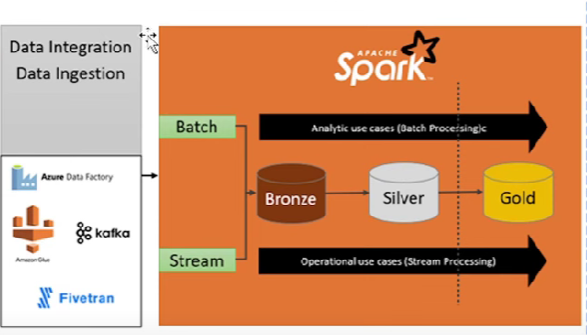

## Data Engineering

---
1. Data Owners : Develop and Manage the business data 
2. Data Engineers : Collect and Transform the data
3. Data Consumers : Monitor and prepare report, Grow the business

### Data Engineer function 
1. Data Integration or ingestion
2. Data Processing or Transformation
3. Data Analytical or Marts

### Data Ingestion approaches
1. Batch : Load Hourly data/daily data
2. RT-Stream : Load the data as source system
3. NRT-Stream : Load the data NRT

## Data Architect

1. Bronze : Raw layer, Data is ingested as it is
2. Silver : Transformed or cleaned data 
3. Gold : More aggregated data 