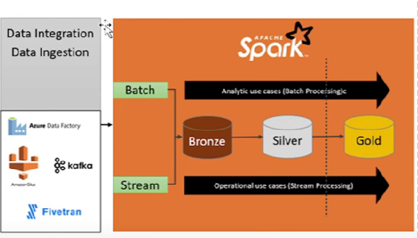

## Data Engineering

---
1. Data Owners : Develop and Manage the business data 
2. Data Engineers : Collect and Transform the data
3. Data Consumers : Monitor and prepare report, Grow the business

### Data Engineer function 
1. Data Integration or ingestion
2. Data Processing or Transformation
3. Data Analytical or Marts

### Data Ingestion approaches
1. Batch : Load Hourly data/daily data
2. RT-Stream : Load the data as source system
3. NRT-Stream : Load the data NRT

## Data Architect

1. Bronze : Raw layer, Data is ingested as it is
2. Silver : Transformed or cleaned data 
3. Gold : More aggregated data 

## 🧩 What are Data Operations?

**Data operations** refer to all activities that involve **managing, processing, moving, transforming, securing, or maintaining data** to make it usable, reliable, and accessible.

In simple terms:
> 🔹 **Data operations are everything you do to keep your data clean, correct, flowing, and ready for use.**

---

### 🔨 Common Types of Data Operations

| Type                  | Examples                                                          |
|:----------------------|:------------------------------------------------------------------|
| **Ingestion**         | Pulling data from sources (databases, APIs, files).               |
| **Transformation**    | Cleaning, formatting, aggregating, or enriching data.             |
| **Storage**           | Saving data into data lakes, databases, or warehouses.            |
| **Validation**        | Checking if data is correct, complete, and consistent.            |
| **Backup/Recovery**   | Saving copies of data and restoring them if needed.               |
| **Security**          | Protecting data via encryption, masking, or access control.       |
| **Monitoring**        | Observing pipelines for failures, delays, or data quality issues. |
| **Data Movement**     | Transferring data between different systems or layers.            |

## 🧩 What is ACID?

> 🔥 **ACID** stands for:
> - **A**tomicity
> - **C**onsistency
> - **I**solation
> - **D**urability

These are key properties that **guarantee reliable database transactions** — and Delta Lake brings these properties to your **data lake files** (like on S3, ADLS, GCS).

---

### 🛠️ ACID Explained (Delta Lake Style)

| Property | What It Means | How Delta Lake Achieves It |
|:---------|:--------------|:---------------------------|
| **Atomicity** | Operations are **all or nothing** (no partial writes). | Writes are recorded as single atomic commits in the `_delta_log/`. |
| **Consistency** | Data must stay **valid** according to schema and rules. | Schema enforcement, transaction checks before commit. |
| **Isolation** | Concurrent transactions should **not interfere** with each other. | Optimistic concurrency control — reads and writes happen safely in parallel. |
| **Durability** | Once a write is **committed**, it will survive failures. | Transaction logs and file system guarantees make changes permanent. |

---
---

### 🚀 Example: How It Works in Practice

Suppose two users are writing to the same Delta Table:

1. User A reads data.
2. User B writes and commits a change (creates a new JSON log).
3. User A tries to write — but Delta detects the conflict.
4. User A’s operation either:
    - Fails gracefully, or
    - Is retried with the updated table version.

✅ Result: No corruption, no data loss, no partial updates.

---