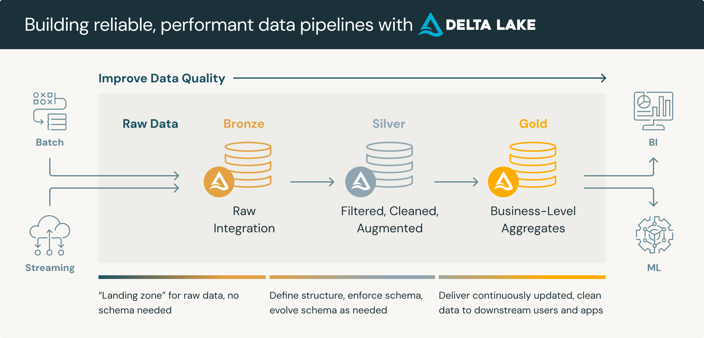

## 📚 Delta Lake Quality Levels

---

### 🧩 What Are Delta Quality Levels?

> 🔥 **Delta Lake Quality Levels** define the stages of **data reliability** and **trust** inside a Lakehouse.

These levels help organize datasets from raw ingestion to production-grade analytics.

 

_(Illustration of Bronze ➡️ Silver ➡️ Gold concept)_

---

### 🥇 Delta Quality Tiers

| Quality Level   | Description                                    | Common Names   | Typical Usage                                        |
|:----------------|:-----------------------------------------------|:---------------|:-----------------------------------------------------|
| 🥉 **Bronze**   | Raw, unfiltered data directly from the source. | Raw Layer      | First landing zone for raw data ingestion.           |
| 🥈 **Silver**   | Cleaned, filtered, and validated data.         | Refined Layer  | Business-ready datasets, joins, enrichments.         |
| 🥇 **Gold**     | Curated, aggregated datasets for reporting.    | Business Layer | KPI dashboards, machine learning, finance reporting. |

---

### 🔥 How Each Level Works

| Aspect   | Bronze                                  |  Silver                             | Gold                                     |
|:---------|:----------------------------------------|:------------------------------------|:-----------------------------------------|
| Source   | Direct ingestion from APIs, logs, files | Cleaned, structured bronze data     | Modeled, aggregated gold-standard data   |
| Quality  | Low                                     | Medium                              | High                                     |
| Usage    | Raw storage, error handling, backups    | Analysis, machine learning features | Business dashboards, financial reporting |
| Schema   | Minimal enforcement                     | Strong enforcement                  | Very strict, versioned                   |

---

### 🛠️ Example Data Pipeline
```
Data Sources (APIs, Logs, Databases)
         ↓
   🥉 Bronze Table (raw ingestion)
         ↓
   🥈 Silver Table (cleaned, refined)
         ↓
   🥇 Gold Table (curated, business-ready)
```

---

### 🚀 Visual Overview
```
+------------+        +------------+        +------------+
|   Bronze   |  --->  |   Silver    |  --->  |    Gold     |
|  Raw Data  |        | Clean Data  |        | Curated Data|
+------------+        +------------+        +------------+
```

---

### 📦 Why Use Quality Levels?

| Benefit                       | Why It Matters                                         |
|:------------------------------|:-------------------------------------------------------|
| 🔒 **Data Governance**        | Different policies at each stage.                      |
| ⚡ **Performance**             | Optimized tables for different workloads.              |
| 📈 **Trust and Transparency** | Clear status of datasets (raw vs refined vs business). |
| 🛠️ **Simplified Debugging**  | Easy to track and fix errors at correct stage.         |

---

